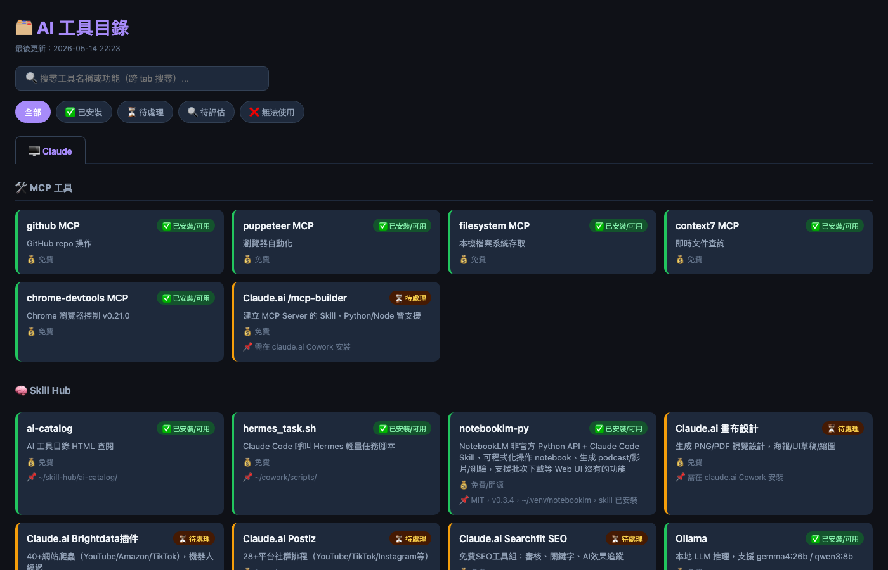

# 🗂️ ai-catalog

[](https://opensource.org/licenses/MIT)
[](https://www.apple.com/tw/macos/)
[](https://www.python.org/)
[](https://claude.com/claude-code)

> 用 Markdown 管理 AI 工具清單，一鍵生成深色主題 HTML 桌面查閱頁，支援多 Agent 分頁、狀態追蹤與 GitHub 自動同步。

---

## 🤔 為什麼需要這個工具？

### 痛點描述

隨著 AI 生態系快速發展，你可能同時安裝了數十個 AI 工具：

- **這個工具屬於哪個 Agent？** Cursor、Windsurf、Claude Code 各有不同的工具生態
- **這個工具裝了沒？** 安裝記錄散落在各處，難以統一追蹤
- **工具版本更新了嗎？** 缺乏統一的狀態管理機制
- **想查詢某個工具時，要開好幾個檔案？** 缺乏統一的視覺化介面

### 解決方案

ai-catalog 讓你用 **Markdown 表格** 做為資料庫，用 **單一指令** 生成美觀的 HTML 頁面，在桌面隨時查閱。所有資料都是純文字版本控制友善，自動推送 GitHub 實現跨裝置同步。

---

## ✨ 核心特色

- **Markdown 驅動的資料庫**：使用人類可讀的 Markdown 表格管理所有 AI 工具資訊
- **一鍵 HTML 生成**：執行 `python generate.py` 即可產生深色主題的桌面查閱頁面
- **多 Agent 分頁支援**：依據 Agent（Cursor、Windsurf、Claude Code 等）自動分類顯示
- **狀態追蹤系統**：內建狀態欄位（Installed/Not Installed/Testing/Deprecated），一目了然
- **launchd 自動監控**：設定後台服務，偵測 Markdown 變更自動重新生成 HTML
- **GitHub 自動同步**：變更時自動推送到遠端，實現跨裝置資料一致
- **Node.js API 提供**：可程式化地新增、查詢、重新生成目錄
- **安全性設計**：內建 command injection 防護，確保系統安全

---

## 🖼️ 畫面預覽



**UI 元素說明：**

| 區域 | 功能描述 |
|------|----------|
| 頂部導航列 | 顯示專案名稱與最後更新時間 |
| Agent 分頁標籤 | 左側邊欄列出所有 Agent，點擊切換檢視 |
| 工具卡片 | 每個工具以卡片呈現，包含名稱、描述、狀態圖示 |
| 狀態指示器 | 綠色勾選（已安裝）、灰色時鐘（待安裝）、黃色測試中、紅色廢棄 |
| 搜尋框 | 即時過濾工具名稱與描述 |
| 底部資訊 | 顯示總工具數量與當前篩選狀態 |

---

## 🏗️ 技術架構

```
┌─────────────────┐     ┌─────────────────┐     ┌─────────────────┐
│   catalog.md    │────▶│  generate.py    │────▶│   index.html    │
│  (Markdown 資料)│     │  (Python 產生器)  │     │  (深色主題 HTML) │
└─────────────────┘     └─────────────────┘     └─────────────────┘
         │                      │                        │
         ▼                      ▼                        ▼
┌─────────────────┐     ┌─────────────────┐     ┌─────────────────┐
│  config.json    │     │   launchd       │     │   GitHub        │
│  (設定檔)        │     │  (自動監控服務)   │     │  (自動同步)      │
└─────────────────┘     └─────────────────┘     └─────────────────┘
```

### 各元件職責

| 元件 | 語言 | 職責 |
|------|------|------|
| `catalog.md` | Markdown | 資料來源，定義所有 AI 工具清單 |
| `generate.py` | Python | 讀取 Markdown 與 config.json，產生 HTML |
| `config.json` | JSON | 設定 Agent 清單、樣式參數、GitHub 資訊 |
| `index.js` | Node.js | 提供 API 介面，可程式化操作 |
| `catalog-add.sh` | Bash | 快速新增工具的指令稿 |
| `com.ai-catalog.plist` | XML | launchd 設定檔，監控檔案變更 |

---

## 📁 專案結構

```
ai-catalog/
├── README.md                    # 本檔案
├── catalog.md                  # AI 工具清單（Markdown 格式）
├── config.json                 # 設定檔（Agent 清單、樣式等）
├── generate.py                 # HTML 生成器（Python）
├── index.js                    # Node.js API 入口
├── package.json                # Node.js 專案設定
├── docs/
│   └── screenshot.png          # 畫面預覽截圖
├── scripts/
│   ├── catalog-add.sh          # 新增工具指令稿範本
│   └── install-launchd.sh      # launchd 安裝指令稿
└── plist/
    └── com.ai-catalog.plist    # launchd 設定檔範本
```

### 檔案說明

| 檔案 | 說明 |
|------|------|
| `catalog.md` | 主要資料檔案，包含所有 AI 工具的 Markdown 表格 |
| `config.json` | 設定檔，定義要顯示的 Agent 分頁、樣式參數、GitHub 遠端資訊 |
| `generate.py` | Python 腳本，解析 Markdown 與 config.json，輸出靜態 HTML |
| `index.js` | Node.js API 伺服器，提供 RESTful 介面操作 catalog |
| `package.json` | Node.js 依賴管理檔案 |
| `catalog-add.sh` | 範例指令稿，展示如何快速新增工具到 catalog |
| `install-launchd.sh` | 自動化 launchd 服務安裝的指令稿 |
| `com.ai-catalog.plist` | macOS launchd 服務定義檔 |

---

## 🚀 快速開始（5 分鐘上手）

### Step 1: Clone 專案

```bash
git clone https://github.com/your-username/ai-catalog.git
cd ai-catalog
```

### Step 2: 複製設定模板

```bash
cp config.json config.json.example
# 編輯 config.json 設定你的 Agent 清單
```

### Step 3: 執行 generate.py 生成 HTML

```bash
python3 generate.py
```

成功執行後，會在目前目錄產生 `index.html`：

```bash
ls -la index.html
```

### Step 4: 設定 launchd 自動監控（可選）

```bash
# 複製 plist 檔案到 LaunchAgents 目錄
cp plist/com.ai-catalog.plist ~/Library/LaunchAgents/

# 載入服務
launchctl load ~/Library/LaunchAgents/com.ai-catalog.plist
```

### Step 5: 在瀏覽器開啟 HTML

```bash
open index.html
```

或將 `index.html` 拖曳到瀏覽器書籤列，方便日後快速存取。

---

## ⚙️ config.json 設定

`config.json` 是整個系統的設定中心。以下是完整欄位說明與範例：

```json
{
  "agents": [
    {
      "id": "cursor",
      "name": "Cursor",
      "color": "#7C3AED"
    },
    {
      "id": "windsurf",
      "name": "Windsurf",
      "color": "#0EA5E9"
    },
    {
      "id": "claude-code",
      "name": "Claude Code",
      "color": "#F59E0B"
    }
  ],
  "github": {
    "remote": "origin",
    "branch": "main",
    "autoPush": true,
    "commitMessage": "Update ai-catalog"
  },
  "html": {
    "title": "AI Tools Catalog",
    "theme": "dark",
    "defaultAgent": "all"
  }
}
```

### 欄位說明

| 欄位 | 類型 | 說明 |
|------|------|------|
| `agents` | Array | Agent 清單，每個物件包含 `id`（唯一識別）、`name`（顯示名稱）、`color`（主題色） |
| `github.remote` | String | Git 遠端名稱，預設為 `origin` |
| `github.branch` | String | 要推送的分支，預設為 `main` |
| `github.autoPush` | Boolean | 變更時是否自動推送到 GitHub |
| `github.commitMessage` | String | 自動 commit 的訊息模板 |
| `html.title` | String | HTML 頁面標題 |
| `html.theme` | String | 主題設定，目前支援 `dark` |
| `html.defaultAgent` | String | 預設顯示的 Agent，`all` 顯示全部 |

### 如何加入自己的 Agent

在 `config.json` 的 `agents` 陣列中新增物件：

```json
{
  "id": "custom-agent",
  "name": "My Custom Agent",
  "color": "#10B981"
}
```

然後在 `catalog.md` 中對應的 Tool 資料列使用 `custom-agent` 作為 Agent 欄位值。

---

## 💡 使用範例

以下是 5 個 `catalog-add.sh` 的實際使用範例：

### 範例 1：新增 Cursor 工具

```bash
./scripts/catalog-add.sh "Windsurf" "AI-powered code editor" "windsurf" "Installed"
```

### 範例 2：新增 Claude Code 工具

```bash
./scripts/catalog-add.sh "Claude Code" "CLI AI assistant" "claude-code" "Installed"
```

### 範例 3：新增測試中的工具

```bash
./scripts/catalog-add.sh "Copilot Workspace" "GitHub Copilot workspace" "cursor" "Testing"
```

### 範例 4：新增尚未安裝的工具

```bash
./scripts/catalog-add.sh "Gemini CLI" "Google's CLI AI tool" "claude-code" "Not Installed"
```

### 範例 5：新增已廢棄的工具

```bash
./scripts/catalog-add.sh "Old Tool" "Deprecated tool" "windsurf" "Deprecated"
```

---

## 📋 Catalog 格式說明

`catalog.md` 使用 Markdown 表格格式儲存所有 AI 工具資訊。

### 表格格式

```markdown
| Tool | Description | Agent | Status | Version |
|------|-------------|-------|--------|---------|
| Cursor | AI-first code editor | cursor | Installed | 0.45.5 |
| Windsurf | AI-powered IDE | windsurf | Installed | 1.0.2 |
| Claude Code | CLI assistant | claude-code | Installed | 1.0.8 |
```

### 欄位說明

| 欄位 | 必填 | 說明 | 範例 |
|------|------|------|------|
| Tool | 是 | 工具名稱 | `Cursor`、`Windsurf` |
| Description | 是 | 工具簡短描述 | `AI-first code editor` |
| Agent | 是 | 所屬 Agent（對應 config.json 中的 id） | `cursor`、`windsurf`、`claude-code` |
| Status | 是 | 目前狀態 | `Installed`、`Not Installed`、`Testing`、`Deprecated` |
| Version | 否 | 目前版本號 | `1.0.0` |

### 狀態圖示對應

| Status | 圖示 | 顏色 |
|--------|------|------|
| Installed | ✅ 綠色勾選 | `#10B981` |
| Not Installed | ⏳ 灰色時鐘 | `#6B7280` |
| Testing | 🔶 黃色測試中 | `#F59E0B` |
| Deprecated | ❌ 紅色廢棄 | `#EF4444` |

---

## 🤖 Node.js API（index.js 用法）

`index.js` 提供 RESTful API，讓你可以程式化地操作 catalog。

### 安裝依賴

```bash
npm install
```

### 啟動伺服器

```bash
node index.js
```

伺服器預設在 `http://localhost:3000` 啟動。

### API 端點

#### 1. 新增工具 (POST /tools)

```bash
curl -X POST http://localhost:3000/tools \
  -H "Content-Type: application/json" \
  -d '{
    "tool": "NewTool",
    "description": "A new AI tool",
    "agent": "cursor",
    "status": "Testing",
    "version": "1.0.0"
  }'
```

#### 2. 列出所有工具 (GET /tools)

```bash
curl http://localhost:3000/tools
```

Response:

```json
{
  "success": true,
  "data": [
    {
      "tool": "Cursor",
      "description": "AI-first code editor",
      "agent": "cursor",
      "status": "Installed",
      "version": "0.45.5"
    }
  ]
}
```

#### 3. 重新生成 HTML (POST /regenerate)

```bash
curl -X POST http://localhost:3000/regenerate
```

Response:

```json
{
  "success": true,
  "message": "HTML regenerated successfully",
  "file": "index.html"
}
```

#### 4. 依 Agent 篩選 (GET /tools?agent=cursor)

```bash
curl "http://localhost:3000/tools?agent=cursor"
```

---

## 🔄 自動更新流程（launchd WatchPaths）

利用 macOS 的 launchd 服務監控 `catalog.md` 檔案變更，自動執行 HTML 重新生成與 GitHub 推送。

### plist 設定說明

`com.ai-catalog.plist` 內容：

```xml
<?xml version="1.0" encoding="UTF-8"?>
<!DOCTYPE plist PUBLIC "-//Apple//DTD PLIST 1.0//EN" "http://www.apple.com/DTDs/PropertyList-1.0.dtd">
<plist version="1.0">
<dict>
    <key>Label</key>
    <string>com.ai-catalog</string>
    <key>ProgramArguments</key>
    <array>
        <string>/usr/bin/python3</string>
        <string>/path/to/ai-catalog/generate.py</string>
    </array>
    <key>WatchPaths</key>
    <array>
        <string>/path/to/ai-catalog/catalog.md</string>
        <string>/path/to/ai-catalog/config.json</string>
    </array>
    <key>RunAtLoad</key>
    <true/>
</dict>
</plist>
```

### 運作流程

1. **檔案監控**：launchd 持續監控 `catalog.md` 與 `config.json`
2. **變更偵測**：當檔案被修改時，自動觸發
3. **HTML 生成**：執行 `generate.py` 重新產生 `index.html`
4. **GitHub 同步**（若啟用）：自動 commit 並 push 到遠端

### 安裝 launchd 服務

```bash
# 複製 plist 檔案
cp plist/com.ai-catalog.plist ~/Library/LaunchAgents/

# 編輯路徑（請替換為實際路徑）
nano ~/Library/LaunchAgents/com.ai-catalog.plist

# 載入服務
launchctl load ~/Library/LaunchAgents/com.ai-catalog.plist

# 驗證服務狀態
launchctl list | grep ai-catalog
```

### 移除服務

```bash
launchctl unload ~/Library/LaunchAgents/com.ai-catalog.plist
rm ~/Library/LaunchAgents/com.ai-catalog.plist
```

---

## 🔒 安全性設計

ai-catalog 重視安全性，特別實作了以下防護機制：

### Command Injection 防護

`generate.py` 採用以下策略防止 command injection：

1. **輸入驗證**：所有來自 Markdown 表格的資料都會經過驗證
2. **參數化處理**：不使用 `eval()` 或 `exec()` 動態執行字串
3. **路徑安全**：使用 `os.path.abspath()` 防止路徑遍歷攻擊
4. **HTML 逸出**：所有輸出到 HTML 的內容都會經過 HTML 逸出處理

```python
# 範例：安全的 HTML 輸出
import html

def escape_html(text):
    """逸出 HTML 特殊字元，防止 XSS"""
    return html.escape(str(text), quote=True)
```

### 檔案權限建議

```bash
# 設定適當的檔案權限
chmod 600 config.json  # 僅擁有者可讀寫（包含 GitHub token）
chmod 755 generate.py
chmod 755 index.js
```

### GitHub Token 安全儲存

建議使用環境變數儲存 GitHub token，而非直接寫在設定檔中：

```bash
export GITHUB_TOKEN="ghp_xxxxxxxxxxxx"
```

在 `generate.py` 中讀取：

```python
import os
github_token = os.environ.get('GITHUB_TOKEN')
```

---

## 🐛 常見問題

### Q1: 生成的 HTML 沒有樣式怎麼辦？

**A:** 請確認 `generate.py` 與 `index.html` 在相同目錄下執行。HTML 內嵌的 CSS 是相對路徑，若移動檔案位置可能導致樣式遺失。建議始終在專案根目錄執行：

```bash
python3 generate.py
```

### Q2: launchd 服務沒有自動觸發怎麼排查？

**A:** 請依序檢查以下項目：

1. 確認 plist 檔案路徑正確：
   ```bash
   ls -la ~/Library/LaunchAgents/com.ai-catalog.plist
   ```

2. 確認服務已載入：
   ```bash
   launchctl list | grep ai-catalog
   ```

3. 檢查系統日誌：
   ```bash
   log show --predicate 'process == "python3"' --last 5m
   ```

4. 確認 WatchPaths 路徑正確（需絕對路徑）

### Q3: 如何在不同裝置間同步 catalog？

**A:** 透過以下步驟實現跨裝置同步：

1. 確保 `config.json` 中 `github.autoPush` 設為 `true`
2. 在每個裝置上 clone 同一個 GitHub repository
3. 在每個裝置上設定 launchd 服務
4. 當任何裝置修改 `catalog.md` 並推送後，其他裝置的 launchd 會偵測到變更並 pull 最新版本

或者手動同步：

```bash
# 在其他裝置上
git pull origin main
python3 generate.py
```

---

## 📄 授權

本專案採用 **MIT 授權**。

```
MIT License

Copyright (c) 2024 ai-catalog

Permission is hereby granted, free of charge, to any person obtaining a copy
of this software and associated documentation files (the "Software"), to deal
in the Software without restriction, including without limitation the rights
to use, copy, modify, merge, publish, distribute, sublicense, and/or sell
copies of the Software, and to permit persons to whom the Software is
furnished to do so, subject to the following conditions:

The above copyright notice and this permission notice shall be included in all
copies or substantial portions of the Software.

THE SOFTWARE IS PROVIDED "AS IS", WITHOUT WARRANTY OF ANY KIND, EXPRESS OR
IMPLIED, INCLUDING BUT NOT LIMITED TO THE WARRANTIES OF MERCHANTABILITY,
FITNESS FOR A PARTICULAR PURPOSE AND NONINFRINGEMENT. IN NO EVENT SHALL THE
AUTHORS OR COPYRIGHT HOLDERS BE LIABLE FOR ANY CLAIM, DAMAGES OR OTHER
LIABILITY, WHETHER IN AN ACTION OF CONTRACT, TORT OR OTHERWISE, ARISING FROM,
OUT OF OR IN CONNECTION WITH THE SOFTWARE OR THE USE OR OTHER DEALINGS IN THE
SOFTWARE.
```

---

**開始使用 ai-catalog，讓你的 AI 工具管理更高效！** 🚀